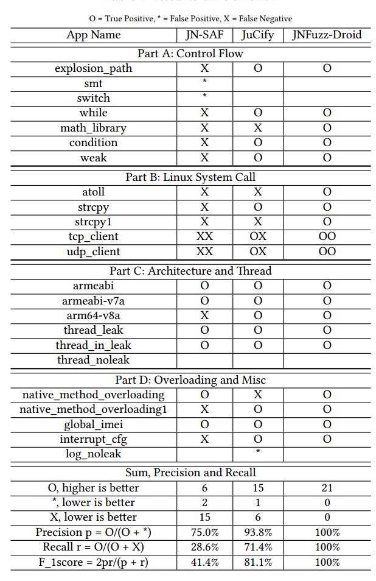

# Description of CCBench

+ **explosion_path:** conditional and loop control: In this apk, sensitive data will leak vai complex path constraints
+ **smt:** conditional and loop control: In this apk, the tainted leak statement is on the conditional statement that cannot be leaked.
+ **switch:** loop control: In this apk, the tainted leak statement is on the switch statement that cannot be leaked.
+ **while:** loop control: In this apk, native code is always in a non-exit state, use while(1) to continue leak the sensitive data.
+ **math_library:** loop control: In this apk, Complex path constraints, we use the return value of sqrt as the basis for judgment.
+ **condition:** conditional control: cross-language conditional constant variables, constants used as branch conditions.
+ **weak:** conditional control: cross-language conditional taint variables, taint variabels used as branch conditions.
+ **atoll:** sensitive data being used as parameters of indirect Linux system call, and we use atoll() to achieve this.
+ **strcpy:** sensitive data being used as parameters of indirect Linux system call, and we use strcpy() to achieve this.
+ **strcpy1:** sensitive data being used as parameters of indirect Linux system call, and we use custom strcpy() to achieve this.
+ **tcp_client:**  sensitive data being used as parameters of direct Linux system call, and we use custom send() to achieve this.
+ **udp_client**:  sensitive data being used as parameters of direct Linux system call, and we use custom sendto() to achieve this.
+ **armeabi:** native code under the arm architecture, and we use the armeabi
+ **armeabi-v7a:** native code under the arm architecture, and we use the armeabi-v7a
+ **arm64-v8a:** native code under the arm architecture, and we use the arm64-v8a
+ **thread_leak:** multiple thread in native code, and we out the thread to leak data.
+ **thread_in_leak:** multiple thread in native code , and we in the thread to leak data.
+ **thread_noleak:** multiple thread in native code ,but we don't leak data
+ **native_method_overloading:** use native method overloading to resolve native function
+ **native_method_overloading1:** use multiple native method overloading to resolve native function
+ **global_imei:** data leakage through global variables
+ **interrupt_cfg:** unrecovered reference variables after being released in JNI
+ **log_noleak:** parameter values of sink methods being constant for test existing tools.

# CCBench

