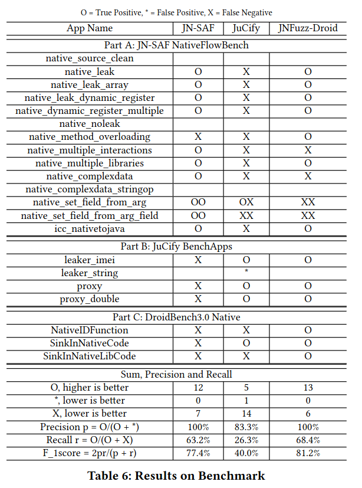
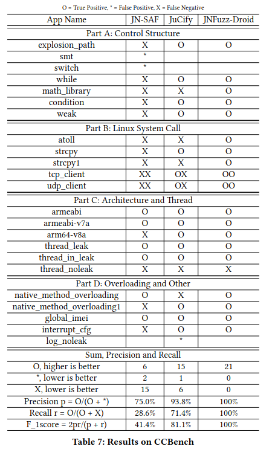

# RQ2. How does JNFuzz-Droid perform on the Benchmark apps?

This section presents performance of JNFuzz-Droid on common benchmarks. In addition, we propose a hand-crafted dataset CCBench for sensitive data leakage in common native world scenarios and compare it with state-of-the-art static analysis tools.

## RQ2.a Results on Benchmarks 

the "native" category  in DroidBench3.0

url:https://github.com/secure-software-engineering/DroidBench/tree/ddbd50c68dde18e1f6b75bfa13c617f986ba9e46

NativeFlowBench

url:https://github.com/arguslab/NativeFlowBench

Benchapps:

url:https://github.com/JordanSamhi/JuCify/tree/master/benchApps

result:

**note1:** At present JNFuzz-Droid does not model custom and complex types, However in NativeFlowBench have six apps use of the custom types, it leads to JNFuzz-Droid had 6 false negative.

**note2：** JNFuzz-Droid relies on existing static analysis tools for capturing potential data leak path from source api to native method. This means that applications that use native methods may be missed by existing static analysis tools and not be detected or identified by these tools.

for example, DroidBench3.0 Native category have 5 apps, but static analysis tools only find 3 apps that which potential data leak path form source api to native method. 

## RQ2.b CCBench

In the anonymous repository of CCBench, we provide the apk and corresponding source code of CCBench, and give the CFG generated when analyzing with JN-SAF and the call graph generated when analyzing with JuCify.

We also 

result:

